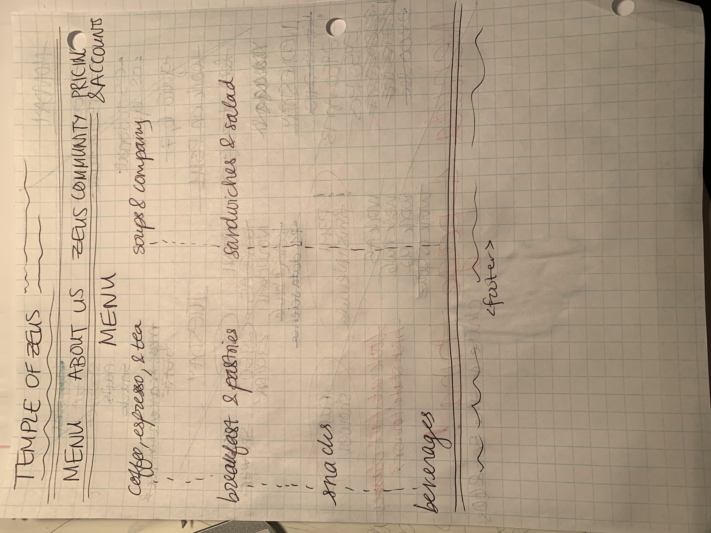
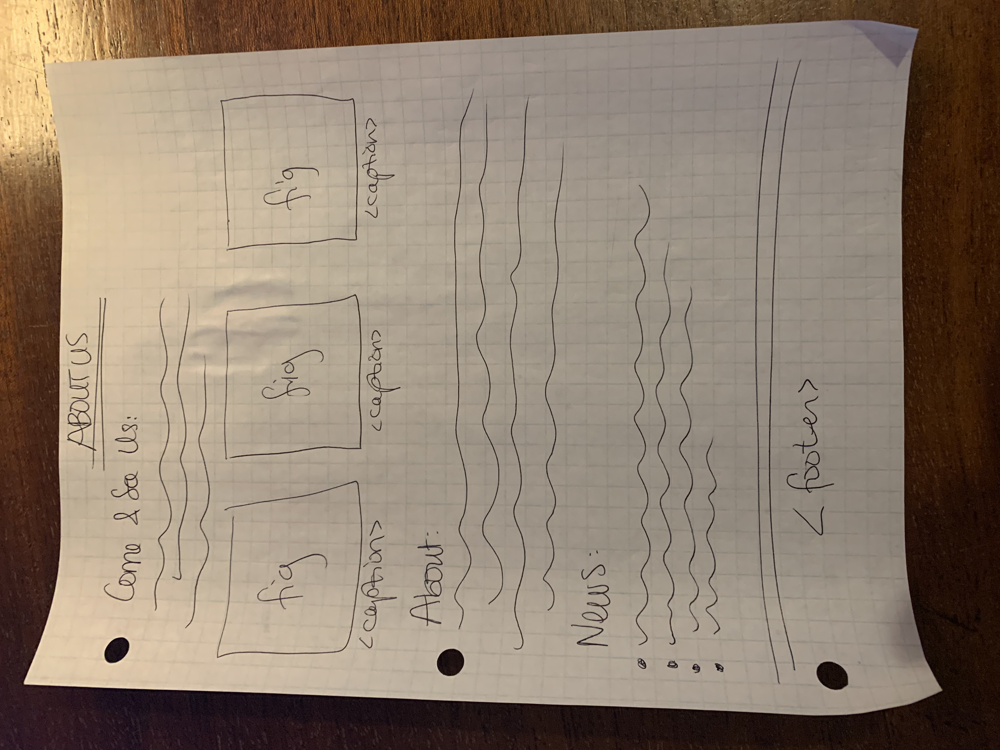
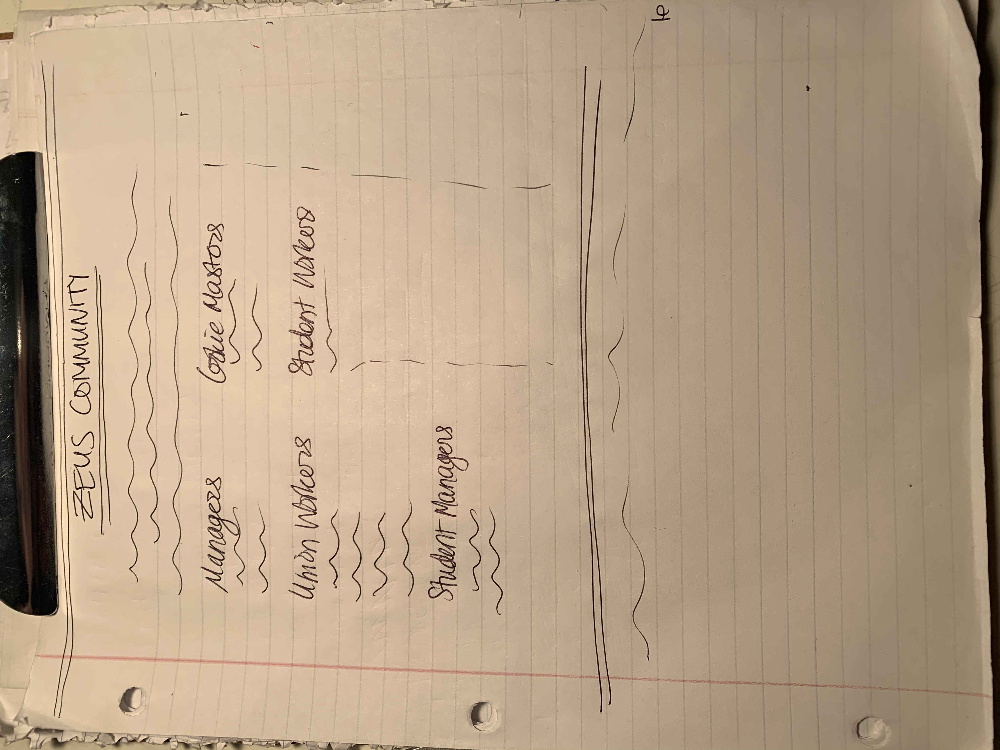
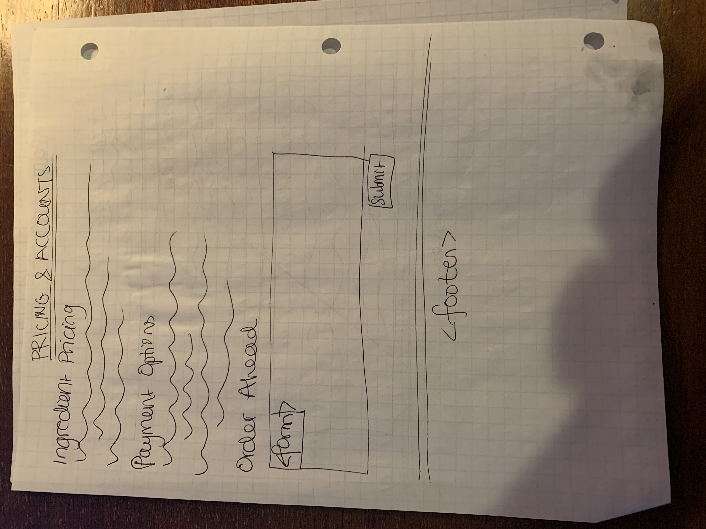
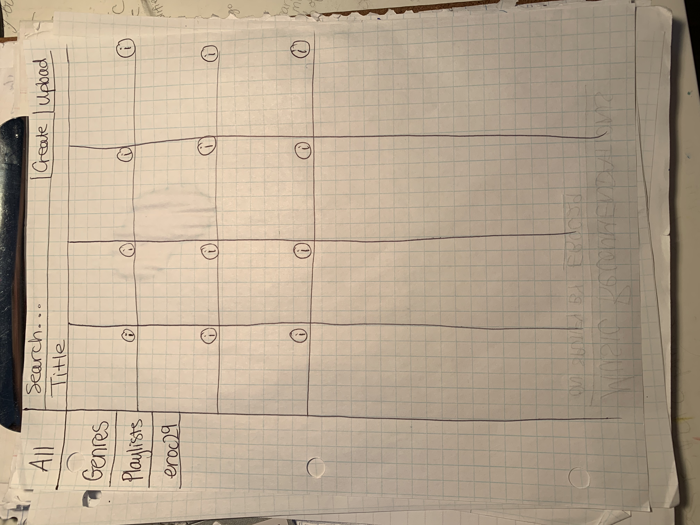
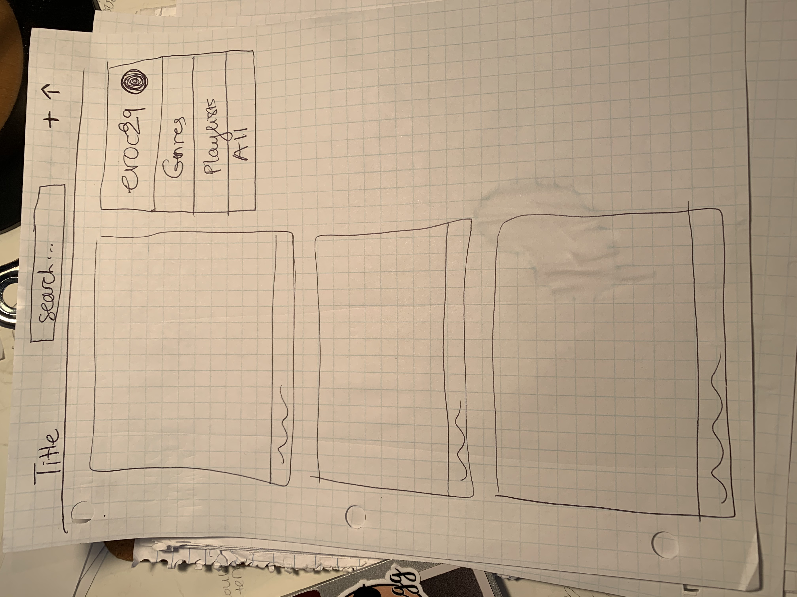
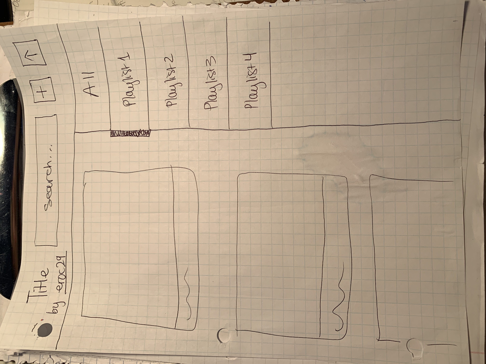
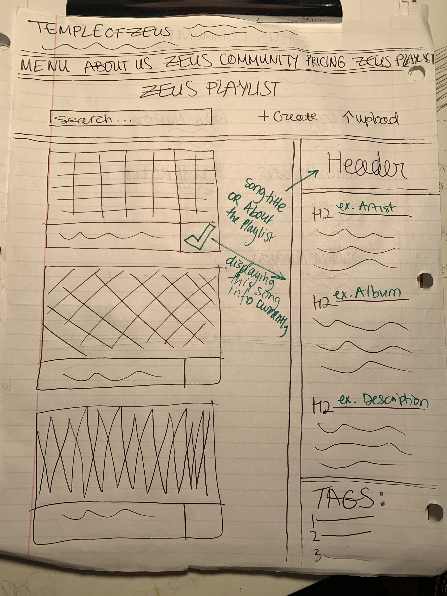
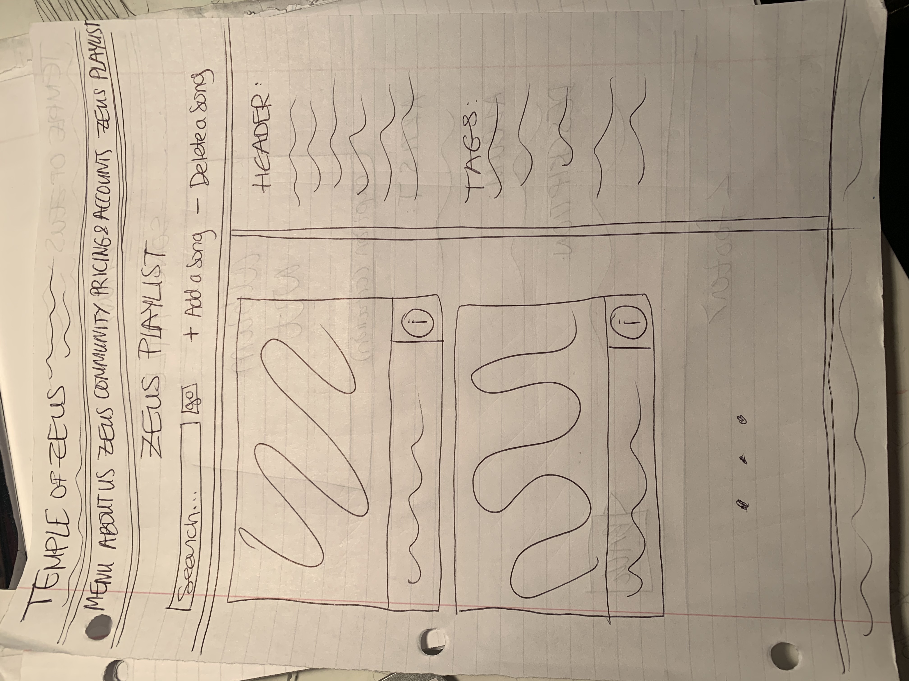
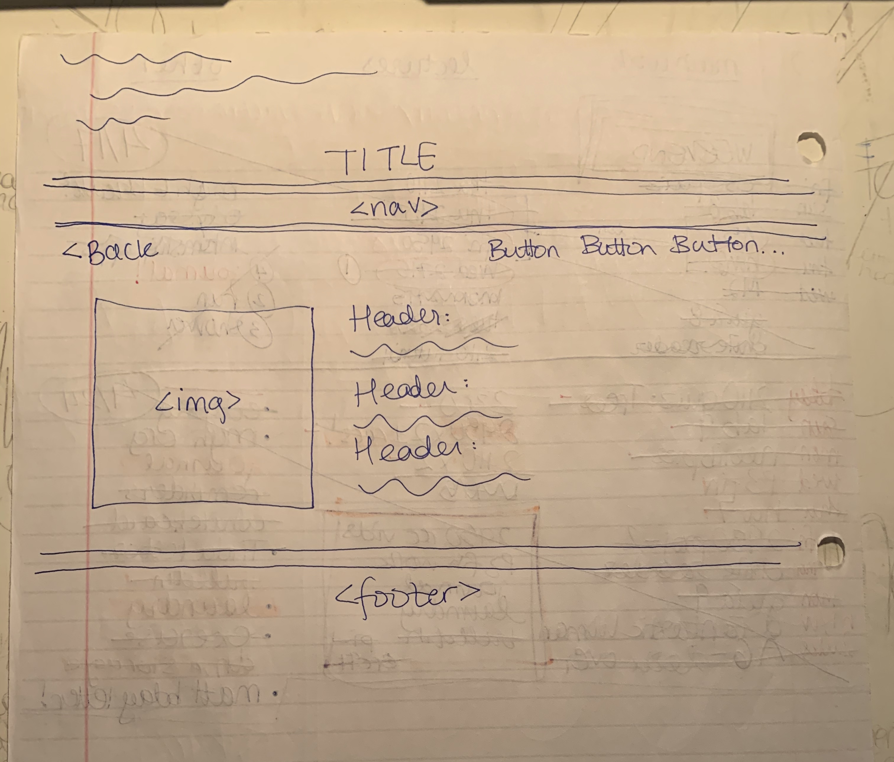

# Project 3: Design Journey

Be clear and concise in your writing. Bullets points are encouraged.

**Everything, including images, must be visible in VS Code's Markdown Preview.** If it's not visible in Markdown Preview, then we won't grade it.

# Design & Plan (Milestone 1)

## Describe your Gallery (Milestone 1)
> What will your gallery be about? 1 sentence.

My image gallery will be a collectino of album artwork for the albums featured on the "Café Playlist," a playlist of albums commonly played at the café curated by Zeus workers and customers.

> Will you be using your existing Project 1 or Project 2 site for this project? If yes, which project?

I will be using my website from project 1.

> If using your existing Project 1 or Project 2, please upload sketches of your final design here.

FINAL DESIGN:

Menu:


About Us:


Zeus Community:


Pricing & Accounts:


Zeus Playlist:
as developed below.

## Target Audience(s) (Milestone 1)
> Tell us about your target audience(s).

My target audience for the whole website is students, faculty, and employees loyal to Zeus's business for its locally sourced ingredients and unique space for good meals, coffee, and conversation at Cornell. These customers have visited Zeus once or many times before and will be using the website to learn more about the café, its story, and the rotating menu so they can plan their next visit for when their favorite soup or beverage is offered.

The main audience for the image gallery of album artwork will be students who want to hear their favorite café-friendly songs played at their favorite on-campus café so that they can listen to music they enjoy while spending time there.

## Design Process (Milestone 1)
> Document your design process. Show us the evolution of your design from your first idea (sketch) to design you wish to implement (sketch). Show us the process you used to organize content and plan the navigation (card sorting), if applicable.
> Label all images. All labels must be visible in VS Code's Markdown Preview.
> Clearly label the final design.

The following photos represent my design process for the image gallery page for the Zeus Playlist (sorry some of the photos are sideways!):


First, I sketched a possible layout that mimicked the setup of Google Photos that I could use for an image gallery template.


It next occurred to me that my target audience is mainly college students, and college students use social media more often than generic image galleries, at least in my experience. So I sketched out a different possible layout that mimics Instagram, the popular social media website for sharing photos.


The resulting combined design incorporates aspects from both of the earlier sketches. I wanted to bring in influences from both, since this site has both social and showcasing roles involved in its purpose as a music recommendation page for the café. The gallery will serve as a catalog of album artwork more than a social networking site, but its presentation is closer to social media than a typical image gallery since it also communicates information about the images on the main gallery page–the album artwork is displayed not only as an aethetic photo but also as a representation of the music and the artist.

Next, I decided not to include the link to the Spotify profile of the playlist host as I had originally drawn, since that was taking the focus away from Zeus and to Spotify, and as I said previously, the goal of the site is only for the target audience to use on a social networking level as far as they are influencing the café atmosphere where they will meet up in person. The site does not need to display personal account information.

I also had originally planned for a nav bar within the image gallery that listed either multiple playlists or different ways to sort the music listed such as by genre, but I realized that the nav bar included should reflect the one on the rest of the site in order to promote continuity and proper best practices. I experimented in the following sketch with ideas of what to include in the sidebar.


This is more or less the final design for the Zeus Playlist page, although it includes a search bar which I later decided not to incorporate since I would be using tags to filter the albums. The design scheme from the combined Google Photos and Instagram inspiration remained while I adapted the gallery to the Zeus site setup. I looked back at the project guidelines and noted that images needed to be displayed individually, and I thought it would make more sense for their accompanying information (such as artist and album) to be shown at that point rather than in the sidebar. I decided the sidebar would be for a general description for the playlist and the full list of tags. I also changed the create button and upload button pair to add and delete to go with the final design. I later renamed those buttons and added more alongside them to increase the usability of the site. I also moved the page title to above the nav bar, which you can see in the following sketch.


If you click on the image information button in the bottom righthand corner of any of the album artwork, the page will navigate to where you can view that song's information clearly on its own, as designed below.



## Design Patterns (Milestone 1)
> Explain how your site leverages existing design patterns for image galleries.
> Identify the parts of your design that leverage existing design patterns and justify their usage.
> Most of your site should leverage existing patterns. If not, fully explain why your design is a special case (you need to have a very good reason here to receive full credit).

My final design is a result of combining ideas from Google Photos, Instagram, and other related galleries that I use such as iPhoto and Spotify.

Google Photos and iPhoto present images in a grid style with a vertical sidebar on the left the page and actions at the top and the title of the collection positioned above the image gallery. I wrote down various categories into which it might be useful to sort the album art and music recommendations to put in the side bar. I stuck with the layout of the nav bar that Instagram uses, which is more of a floating set of information and less of a defined sidebar, which I think works better for this site's purpose as the resulting scrolling layout of the page is reminiscent of the way playlists and songs are displayed in music apps like Spotify. As a result, I think my final design has adopted more of the design ideas of Instagram and Spotify than of Google Photos or iPhoto, which goes well with the site's purpose and what the target audience is familiar with. Instagram presents not a grid but a scrolling stack of photos with captions that you can see without clicking on the image for further information. I chose to go with that style of larger images with the vertical scroll and visible captions, since I intend to display the artist and song title with the album art so that it is easy for users to know what song(s) is/are being recommended from each album. I also went with the floating sidebar on the right side instead of the left. The user's eye will naturally gravitate first toward the photos and then toward the information there, which is less important and therefore does not need to be the focus of the page.

## Requests (Milestone 1)
> Identify and plan each request you will support in your design.
> List each request that you will need (e.g. view image details, view gallery, etc.)
> For each request, specify the request type (GET or POST), how you will initiate the request: (form or query string param URL), and the HTTP parameters necessary for the request.

- Request: view genre (tag)
  - Type: GET
  - Init: query string param URL
  - Params: genre
- Request: view album details
  - Type: GET
  - Init: query string param URL
  - Params: album
- Request: add album
  - Type: POST
  - Init: form
- Request: delete album
  - Type: POST
  - Init: form
- Request: create tag
  - Type: POST
  - Init: form
- Request: add tag
  - Type: POST
  - Init: form
- Request: remove tag
  - Type: POST
  - Init: form

## Database Schema Design (Milestone 1)
> Plan the structure of your database. You may use words or a picture.
> Make sure you include constraints for each field.

> Hint: You probably need `images`, `tags`, and `image_tags` tables.

> Hint: For foreign keys, use the singular name of the table + _id. For example: `image_id` and `tag_id` for the `image_tags` table.

table of albums in the playlist and their album art images:
```
CREATE TABLE `albums` (
	`id`	INTEGER NOT NULL PRIMARY KEY AUTOINCREMENT UNIQUE,
	`artist`	TEXT NOT NULL,
	`title`	TEXT NOT NULL,
  `file_ext` TEXT NOT NULL,
  `citation` TEXT NOT NULL
);
```

all tags:
```
CREATE TABLE `tags` (
    `id` INTEGER NOT NULL PRIMARY KEY AUTOINCREMENT UNIQUE,
    `genre` TEXT UNIQUE NOT NULL
);
```

tags for a specific image:
```
CREATE TABLE `album_tags` (
    `id` INTEGER NOT NULL PRIMARY KEY AUTOINCREMENT UNIQUE,
    `album_id` INTEGER,
    `tag_id` INTEGER
);
```

## Database Query Plan (Milestone 1)
> Plan your database queries. You may use natural language, pseudocode, or SQL.
> Using your request plan above, plan all of the queries you need.

1. create tag
```php
  $tag_sql = "INSERT INTO tags (genre) VALUES (:genre)";
        $tag_params = array(':genre' => $newGenre);
        $tag_result = exec_sql_query($db, $tag_sql, $tag_params);

  $album_tag_sql = "INSERT INTO album_tags (album_id,tag_id) VALUES (:album_id, :tag_id)";
        $album_tag_params = array(
            ':album_id' => $attach_id[0]["id"],
            ':tag_id'=> $db->lastInsertId("id")
        );
        $album_tag_result = exec_sql_query($db, $album_tag_sql, $album_tag_params);
  ```

2. add album
```php
$albums_sql = "INSERT INTO albums (artist, title,file_ext, citation) VALUES (:artist, :title,:file_ext, :citation)";
      $albums_params = array(
      ':artist' => $artist_name,
      ':title' => $album_title,
      ':file_ext' => $upload_ext,
      ':citation' => $citation);
      $albums_result = exec_sql_query($db, $albums_sql, $albums_params);

      $alId = $db->lastInsertId("id"); //save for use twice

      //album_tags
      $album_tags_sql = "INSERT INTO album_tags (album_id) VALUES (:album_id)";
      $album_tags_params = array(
      ':album_id' => $alId); //corresponds to album insert
      $album_tags_result = exec_sql_query($db, $album_tags_sql, $album_tags_params);
```

3. delete album
```php
$info_sql = "SELECT id, file_ext FROM albums WHERE (title = :title)";
        $info_params = array(
            ':title' => $toDelete);
        $info = exec_sql_query($db, $info_sql, $info_params)->fetchAll(PDO::FETCH_ASSOC);

        //albums
        $album_sql = "DELETE FROM albums WHERE (title = :title)";
        $album_params =  array(
            ':title' => $toDelete);
        $album_result = exec_sql_query($db, $album_sql, $album_params);

        //album-tags
        $album_tag_sql = "DELETE FROM album_tags WHERE (album_id = :album_id)";
        $album_tag_params = array(
            ':album_id' => $info[0]["id"]);
        $album_tag_result = exec_sql_query($db, $album_tag_sql, $album_tag_params);
```

4. add tag
```php
$addTo_sql = "INSERT INTO album_tags (album_id,tag_id) VALUES (:album_id, :tag_id)";
        $addTo_params = array (
            ":album_id"=>$albId,
            ":tag_id" =>$toTag
        );
        $addTo_result = exec_sql_query($db, $addTo_sql, $addTo_params);
```

5. delete tag
```php
  $removeFrom_sql = "DELETE FROM album_tags WHERE (album_id = :album_id) AND (tag_id = :tag_id)";
  $removeFrom_params = array (
      ":album_id" => $albumId[0]['id'],
      ":tag_id" => $toUntag
  );
  $removeFrom_result = exec_sql_query($db, $removeFrom_sql, $removeFrom_params);
```


## Code Planning (Milestone 1)
> Plan what top level PHP pages you'll need.

index.php (Menu), aboutUs.php (About Us), comm.php (Zeus Community), pricing.php (Pricing & Accounts), playlist.php (Café Playlist)

> Plan what partials you'll need.

init.php, head.php, header.php, nav.php, footer.php

> Plan any PHP code you'll need.

Example:
```
Put all code in between the sets of backticks: ``` code here ```
```

Init Database
```php
$db = open_or_init_sqlite_db("secure/site.sqlite", "secure/init.sql");
```

GET requests with QSPs
```php
$get_album = trim($_GET["album"]);
$get_tag = trim($_GET["genre"]);
```

User feedback
```php
    $messages = array();
    foreach ($messages as $message) {
    echo "<p>" . htmlspecialchars($message) . "</p>\n";
    }
```

SQL queries
```php
    $sql = "SELECT * FROM table;";
    $params = array (...);
    $result = exec_sql_query($db, $sql, $params);
```

Display databse info on page
```php
    $records = $result->fetchAll();
        foreach($records as $record) {
            print_record($record);
        }
```

POST requests
```php
if (isset($_POST["submit_upload"]) {
  $valid = TRUE;
  ...
}
  ```

Check uploads for errors, extract data
  ```php
  if($upload['error']==UPLOAD_ERR_FORM_SIZE){
    array_push($messages, "File size exceeds max. Try uploading a smaller photo.");
  }
  if ($valid && $upload['error']==UPLOAD_ERR_OK){
    ...
  }
  ```

Extract the file name in order to store it in the database
```php
      $basename = basename($upload["name"]);
      $upload_ext = strtolower(pathinfo($basename, PATHINFO_EXTENSION));
```

Store in db
```php
      $new_path = "uploads/albums/" . $alId . "." . $upload_ext;
      move_uploaded_file($_FILES["album_art"]["tmp_name"], $new_path);
```


# Complete & Polished Website (Final Submission)

## Gallery Step-by-Step Instructions (Final Submission)
> Write step-by-step instructions for the graders.
> For each set of instructions, assume the grader is starting from index.php.

Viewing all images in your gallery:
1. Navigate to the "Café Playlist" page in the nav bar.

View all images for a tag:
1. Navigate to the "Café Playlist" page in the nav bar.
2. Look for the header "All Tagged Genres" on the right of the page, and click on any of the listed tags.

View a single image and all the tags for that image:
1. Navigate to the "Café Playlist" page in the nav bar.
2. Click on the round i button (the familiar symbol for information).

How to upload a new image:
1. Navigate to the "Café Playlist" page in the nav bar.
2. Click on the "+ Add Album" action button at the top of the page (below the main nav bar).

How to delete an image:
1. Navigate to the "Café Playlist" page in the nav bar.
2. Click on the "– Delete Album" action button at the top of the page (below the main nav bar).

How to view all tags at once:
1. Navigate to the "Café Playlist" page in the nav bar.
2. Look at the listing under the header "All Tagged Genres."

How to add a tag to an existing image:
1. Navigate to the "Café Playlist" page in the nav bar.
2. Click on the "+ Tag Album" action button at the top of the page (below the main nav bar).

How to remove a tag from an existing image:
1. Navigate to the "Café Playlist" page in the nav bar.
2. Click on the "– Untag Album" action button at the top of the page (below the main nav bar).


## Reflection (Final Submission)
> Take this time to reflect on what you learned during this assignment. How have you improved since starting this class?

This assignment helped me understand a lot more about coding in PHP and SQL as well as using query string parameters. I have to say I was extremely confused initially about when and how to use these, and although I spent a huge amount of time (which I enjoyed, but still a lot!) on this assignment, learning as I went and going back and redoing parts I realized  hadn't intially implemented correctly. I had to fight a lot with my init.sql, did a lot of debugging forms using var_dump() which was very helpful, and learned what the "->fetchAll(PDO::FETCH_ASSOC)" code means. I'm proud of the final product, and I feel like it would go a lot faster next time!
